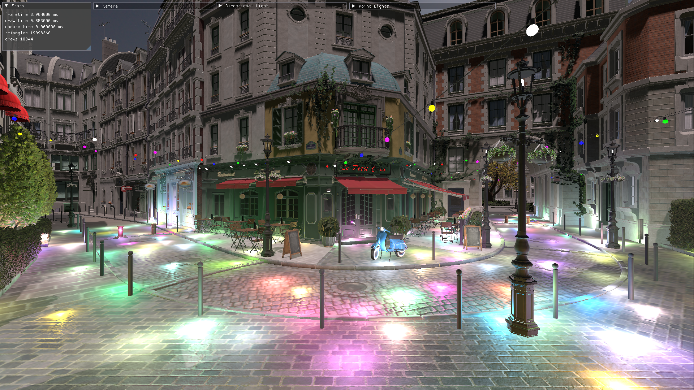
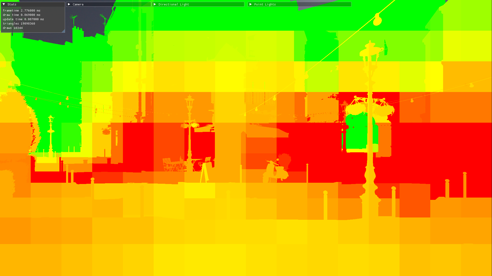
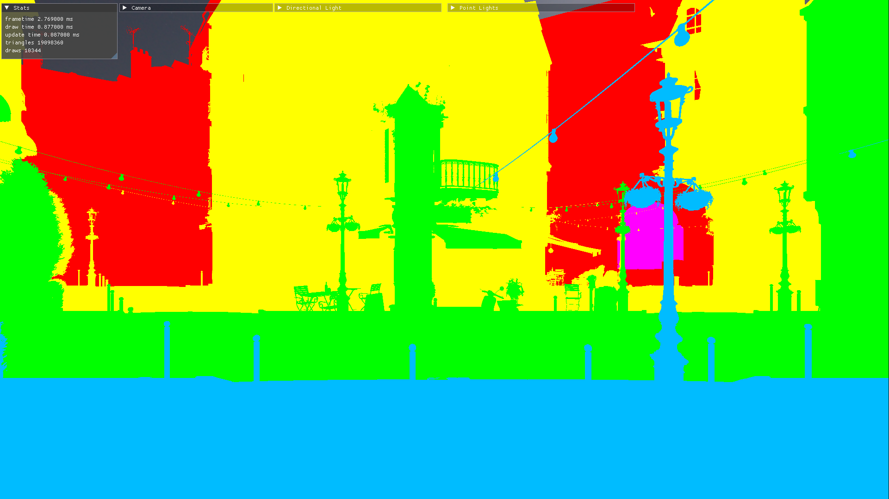
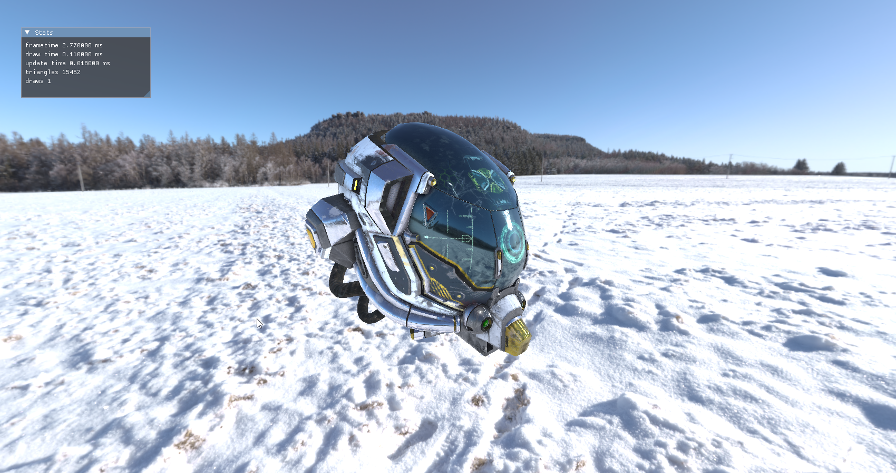

# vulkan-pbr - Clustered Forward PBR Rendering Engine

Vulkan (1.3) real-time Physically Based Rendering engine, using Dynamic Rendering. Built on top of [vkguide.dev](https://vkguide.dev) (chapters 0-5 inclusive)

## Rendering Features:
- Clustered Forward Shading
  - Compute Shader based clustered light culling
- Cascaded Shadow Mapping
  - Percentage Closer Filtering (PCF) using Poisson disc sampling
- Physically Based Rendering (PBR)
  - Cook-Torrance Specular + Lambertian Diffuse
  - Metallic Workflow
- Image Based Lighting (IBL)
  - Compute Shader based generation of cubemaps and BRDF LUT
  - Filtered Importance Sampling
- Directional and Point lights
- Depth Pre-pass
- Tangent space normal mapping
- Ambient Occlusion (AO) + Emissive mapping
- Premultiplied alpha textures

## Other Engine Features (courtesy of vkguide):
- glTF 2.0 scene graph loading using [fastgltf](https://github.com/spnda/fastgltf)
- Windowing and input using [SDL2](https://github.com/libsdl-org/SDL/tree/SDL2)
- Immediate mode GUI using [Dear ImGui](https://github.com/ocornut/imgui)
- Vulkan memory allocations using [VulkanMemoryAllocator (VMA)](https://github.com/GPUOpen-LibrariesAndSDKs/VulkanMemoryAllocator)

# Images

